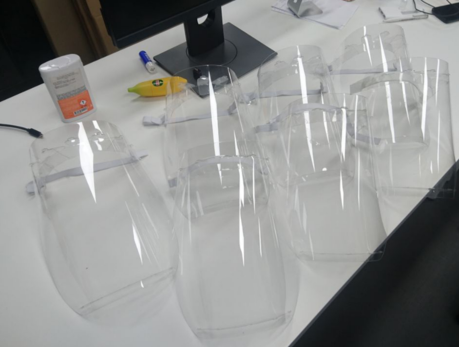
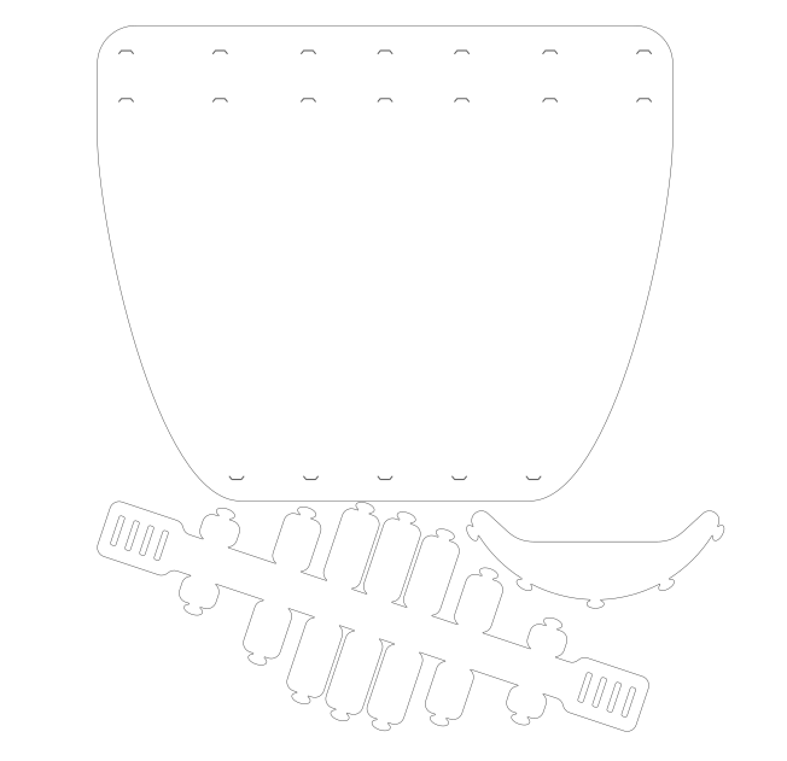

Защитный щиток
===

Из листа ПЭТ (ПЭТГ) 0.5 мм
для раскроя на лазере

UPD v4 адаптирована под 0.5мм

Ссылка на скачивание:
---

https://github.com/minsk-hackerspace/madeinmxc/raw/master/face_shield/flop.zip

Два размера:
---

В файле два варинта отверстий для креплений к дужке
Это для разноно размера щитков

- 1 высокий вариант - отверстия выше (щитки получаются длиннее / размер L)
- 2 низний варинат - отверстия ниже (щитки получаются короче / размер S)

Если есть возможность редактировать файл удалите один ряд отверстий и режте в двух размерах:

- 40% первого варинта (размера L) 
- 60% второго варианта (размера S) 

Универсальная:
---

Если нет возможности редактировать файл при вырезании то пусть режутся оба типа отверстий.
просто при сборке использовать один из рядов

Фото:
---

