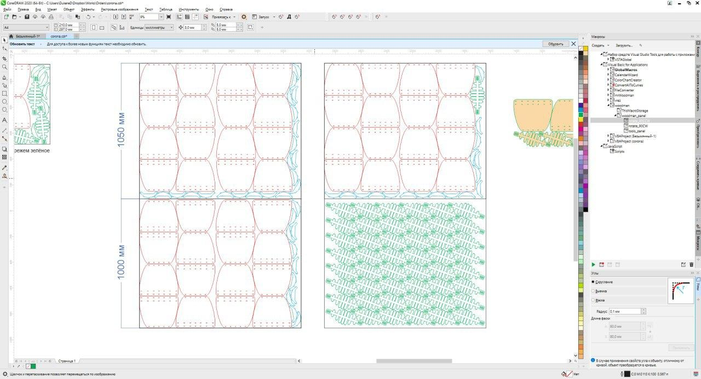

Protective shield
===
1 shield = $1 = 15 minutes

Laser cut from PETG sheet 0.5mm

UPD v4 adjusted for 0.5mm

UPD v5 added optimized from [@IDukereD](https://github.com/IDukereD)

Защитный щиток 
===
1 щиток = $1 = 15 минут

Из листа ПЭТ (ПЭТГ) 0.5 мм
для раскроя на лазере

UPD v4 адаптирована под 0.5мм

UPD v5 Добавлены скругления и оптимальная раскладка под весь лист от [@IDukereD](https://github.com/IDukereD)

Ссылка на скачивание: / Link to download:
---

https://github.com/minsk-hackerspace/madeinmxc/raw/master/face_shield/flop.zip

Фото: / Photo:
---

